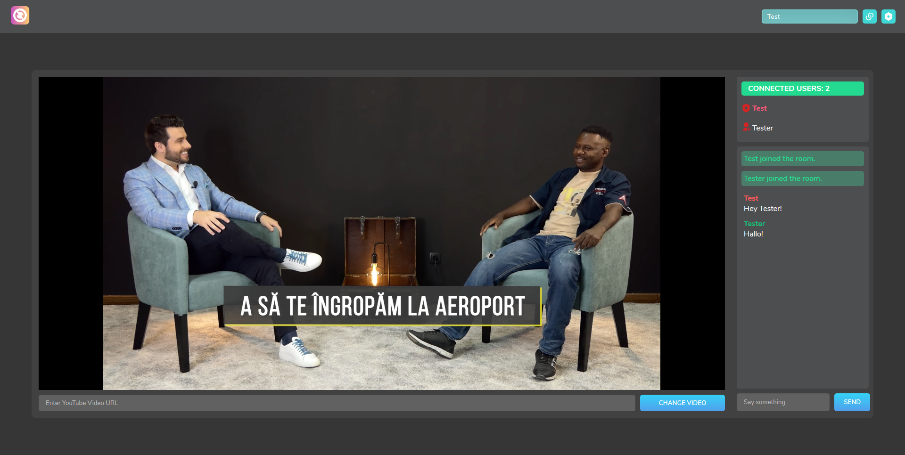

# Vaadake Koos

Vaadake Koos is a web application that allows you to watch youtube videos with your friends in sync.

You can view the live app at [Vaadake Koos](https://vaadakekoos.web.app).

## Available Scripts

### Install the dependencies

```
yarn install
```

### Runs the app in the development mode and starts up the local server.

```
yarn dev
```

Open [http://localhost:3000](http://localhost:3000) to view it in the browser.

## Technologies
Project is created with:
* React
* Node.js
* Express
* Google App Engine
* Firebase
* Socket.io
* SCSS

## Dark Mode Screenshot of the app
